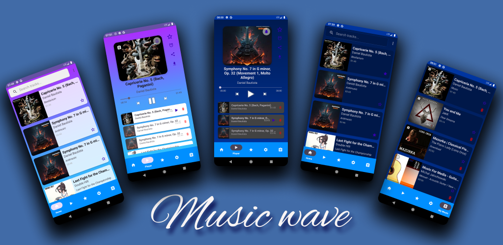
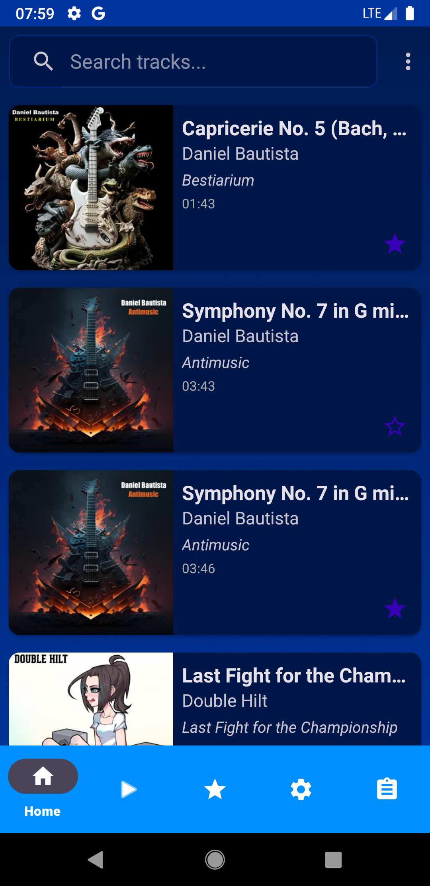
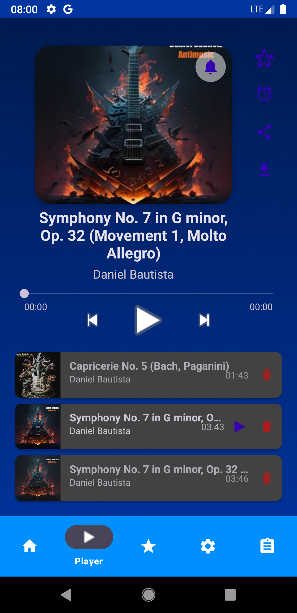
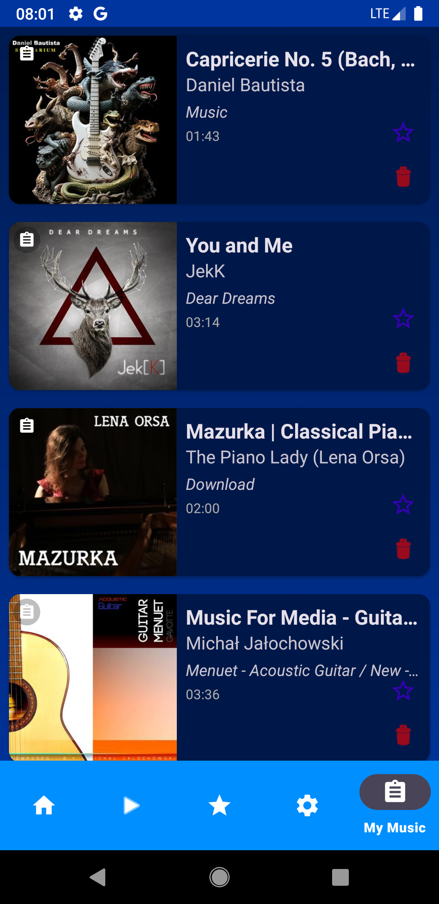

# Music Wave 🎵

Приложение для удобного поиска и прослушивания музыки с использованием Jamendo API.

## 📱 Скриншоты

### Промо

### Интерфейс пользователя

|                           Главный экран                            |                              Воспроизведение                               |                          Офлайн медиатека                          |
|:------------------------------------------------------------------:|:--------------------------------------------------------------------------:|:------------------------------------------------------------------:|
|  |  |  |

## 🛠 Стек технологий
* **Язык:** Kotlin
* **Архитектура:** Clean Architecture + MVVM (Model-View-ViewModel)
* **DI:** Hilt (Dagger)
* **Асинхронность:** Coroutines & Flow
* **Сеть:** Retrofit 2 + Gson + OkHttp (Logging Interceptor)
* **База данных:** Room (кэширование и список избранного)
* **Медиа:** Media3 ExoPlayer (фоновое воспроизведение, уведомления, управление на экране блокировки)
* **UI:** Material Design 3, View Binding, Navigation Component
* **Загрузка изображений:** Coil
* **Другое:** SwipeRefreshLayout, PreferenceProvider (SharedPreferences)

## 🌟 Основной функционал
* **Умный поиск:** Находите любимые композиции, альбомы и исполнителей в одно мгновение.
* **Категории музыки:** Удобный выбор музыки по жанрам и настроению.
* **Офлайн-режим:** Загружайте понравившиеся треки и слушайте их без подключения к интернету.
* **Локальная медиатека:** Проигрывание аудиофайлов, хранящихся на вашем устройстве.
* **Превосходный звук:** Качественное и плавное воспроизведение благодаря современному движку ExoPlayer.
* **Интуитивный интерфейс:** Лаконичный и современный дизайн в стиле Material 3.
* **Полный контроль:** Управляйте музыкой через стильные уведомления и экран блокировки.
* **Поделиться:** Делитесь ссылками на понравившиеся треки с друзьями в один клик.

## 📦 Сборка и установка
1. Клонируйте репозиторий: `git clone https://github.com/ваш_логин/Music-Wave.git`
2. Откройте проект в Android Studio.
3. Дождитесь завершения Gradle Sync.
4. Соберите и запустите приложение на эмуляторе или реальном устройстве.

---
*Разработано с использованием API Jamendo.*
